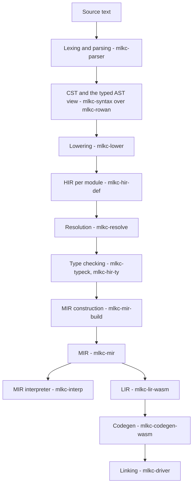

# Architecture

This is the map of the compiler:
the pipeline, the crates that implement it,
and the places to start when changing something.
It says what _is_; the _why_ is recorded in [`docs/adr`](../adr/README.md).
When the code and this file disagree, the code wins — fix the map.

The vocabulary is in [glossary.md](glossary.md).

## The pipeline

Two hosts drive this pipeline and own everything the driver must not
(files, processes, the browser):
the CLI `mlkc` in [`mlkc-cli`](../../crates/mlkc-cli)
and the browser host in [`mlkc-wasm`](../../crates/mlkc-wasm).
The editor under `web/` loads the browser host.
No pass knows that a host exists
([ADR-0008](../adr/0008-compiler-driver.md),
[ADR-0009](../adr/0009-pass-contract.md)).

The stage names and their parallelism are fixed by
[ADR-0005](../adr/0005-compiler-pipeline.md).
The driver runs passes per unit —
a file, a module, a body, a project —
and memoizes each one; a pass is a pure function of an assembled input,
and the driver decides whether the value it holds is still current.

## Passes the driver runs

The names below are the ones the driver reports in its stats
(the editor's Stats panel, and `stats()` of `mlkc-wasm`),
so they are also the names to look for when something is slow.

| Pass                     | Produces                                                          | Crate                                                                                    |
| ------------------------ | ----------------------------------------------------------------- | ---------------------------------------------------------------------------------------- |
| `parse`                  | the lossless CST and the parser's diagnostics                     | [`mlkc-parser`](../../crates/mlkc-parser)                                                |
| `lower`                  | `ItemTree` and the `Body` of each entity                          | [`mlkc-lower`](../../crates/mlkc-lower) into [`mlkc-hir-def`](../../crates/mlkc-hir-def) |
| `line_index`             | the line and column mapping of a file                             | [`mlkc-line-index`](../../crates/mlkc-line-index)                                        |
| `interface`              | `Interface`: what a module shows to the modules that import it    | [`mlkc-hir-def`](../../crates/mlkc-hir-def), built by the driver                         |
| `module_index`           | `ModuleIndex`: which path of a project names which module         | [`mlkc-hir-def`](../../crates/mlkc-hir-def), built by the driver                         |
| `resolution`             | `Resolution`: what the names of a module denote                   | [`mlkc-resolve`](../../crates/mlkc-resolve)                                              |
| `resolution_diagnostics` | resolve diagnostics, rendered for a host                          | [`mlkc-driver`](../../crates/mlkc-driver)                                                |
| `def_map`                | `ModuleScope` and `ProjectDefMap`                                 | [`mlkc-hir-def`](../../crates/mlkc-hir-def), folded by the driver                        |
| `signatures`             | the declared signatures of a module                               | [`mlkc-typeck`](../../crates/mlkc-typeck), held by the driver                            |
| `type_diagnostics`       | type diagnostics, rendered for a host                             | [`mlkc-driver`](../../crates/mlkc-driver)                                                |
| `parse_diagnostics`      | parse diagnostics, rendered for a host                            | [`mlkc-driver`](../../crates/mlkc-driver)                                                |
| `check`                  | `CheckedBody`: the types of one body                              | [`mlkc-typeck`](../../crates/mlkc-typeck) into [`mlkc-hir-ty`](../../crates/mlkc-hir-ty) |
| `mir`                    | `mlkc_mir::Body`, the CFG form                                    | [`mlkc-mir-build`](../../crates/mlkc-mir-build)                                          |
| `ssa`                    | the SSA form of a MIR body                                        | [`mlkc-mir-build`](../../crates/mlkc-mir-build)                                          |
| `mir_module`             | `ModuleMir`: the functions of a module and the calls between them | [`mlkc-codegen-wasm`](../../crates/mlkc-codegen-wasm), built by the driver               |
| `lir`                    | `mlkc_lir_wasm::Body`: the target instructions in SSA form        | [`mlkc-lir-wasm`](../../crates/mlkc-lir-wasm)                                            |
| `link`                   | `LinkPlan` and the `Manifest` a host runs                         | [`mlkc-driver`](../../crates/mlkc-driver)                                                |

## Crates

### The pipeline

| Crate                                                     | Responsibility                                                                                         |
| --------------------------------------------------------- | ------------------------------------------------------------------------------------------------------ |
| [`mlkc-driver`](../../crates/mlkc-driver)                 | Owns the inputs and the memoized passes; the only component that decides what has to be recomputed.    |
| [`mlkc-parser`](../../crates/mlkc-parser)                 | Turns the source of a module into a lossless CST and diagnostics.                                      |
| [`mlkc-parser-core`](../../crates/mlkc-parser-core)       | The event-based parser infrastructure; see its `CONTRIBUTING.md`.                                      |
| [`mlkc-syntax`](../../crates/mlkc-syntax)                 | The typed AST view over the CST: `SyntaxKind`, generated node wrappers.                                |
| [`mlkc-syntax-factory`](../../crates/mlkc-syntax-factory) | The generated factory that builds syntax nodes.                                                        |
| [`mlkc-rowan`](../../crates/mlkc-rowan)                   | The vendored lossless syntax tree library.                                                             |
| [`mlkc-lower`](../../crates/mlkc-lower)                   | The lowering of MLK into the HIR; the only stage that knows syntactic sugar.                           |
| [`mlkc-hir-def`](../../crates/mlkc-hir-def)               | The definitions of the high-level IR, and the module/def-map values.                                   |
| [`mlkc-resolve`](../../crates/mlkc-resolve)               | Global name resolution: what a module's paths denote, against the interfaces of the modules they name. |
| [`mlkc-hir-ty`](../../crates/mlkc-hir-ty)                 | A resolved type, and what a check leaves behind.                                                       |
| [`mlkc-typeck`](../../crates/mlkc-typeck)                 | The temporary checker: one body at a time ([ADR-0017](../adr/0017-resolved-types.md)).                 |
| [`mlkc-mir`](../../crates/mlkc-mir)                       | The middle IR: a uniform control-flow graph over words.                                                |
| [`mlkc-mir-build`](../../crates/mlkc-mir-build)           | The construction of MIR and its SSA form.                                                              |
| [`mlkc-interp`](../../crates/mlkc-interp)                 | The interpreter of MIR: the reference semantics a back end is measured against.                        |
| [`mlkc-lir-wasm`](../../crates/mlkc-lir-wasm)             | The WASM LIR: the target's instructions in SSA form ([ADR-0022](../adr/0022-wasm-lir.md)).             |
| [`mlkc-codegen-wasm`](../../crates/mlkc-codegen-wasm)     | The WASM back end: MIR to LIR, LIR to a module ([ADR-0020](../adr/0020-wasm-backend.md)).              |
| [`mlkc-stdlib`](../../crates/mlkc-stdlib)                 | The standard library sources and the values that describe it.                                          |
| [`mlkc-fixture`](../../crates/mlkc-fixture)               | The one-file project format the tests are written in.                                                  |

### Infrastructure

| Crate                                               | Responsibility                                                     |
| --------------------------------------------------- | ------------------------------------------------------------------ |
| [`mlkc-diagnostics`](../../crates/mlkc-diagnostics) | `Diagnostic`, labels, levels, rendering, and the ICE macro.        |
| [`mlkc-span`](../../crates/mlkc-span)               | Re-exports the text range and file identity types.                 |
| [`mlkc-vfs`](../../crates/mlkc-vfs)                 | Owns the current state of every file: path, contents, and version. |
| [`mlkc-paths`](../../crates/mlkc-paths)             | Absolute and relative path wrappers over `camino`.                 |
| [`mlkc-line-index`](../../crates/mlkc-line-index)   | The mapping between byte offsets and line/column positions.        |
| [`mlkc-text-size`](../../crates/mlkc-text-size)     | Type-safe newtypes for text sizes and ranges.                      |
| [`mlkc-text-edit`](../../crates/mlkc-text-edit)     | The representation of a `TextEdit`.                                |
| [`mlkc-intern`](../../crates/mlkc-intern)           | Global `Arc`-based interning of names.                             |
| [`mlkc-la-arena`](../../crates/mlkc-la-arena)       | An index arena with option-optimized indices.                      |
| [`mlkc-string-case`](../../crates/mlkc-string-case) | String case detection and conversion, used by codegen.             |
| [`mlkc-ungrammar`](../../crates/mlkc-ungrammar)     | The fork of the ungrammar DSL the code generator reads.            |

### Hosts

| Crate                                 | Responsibility                                                                                                  |
| ------------------------------------- | --------------------------------------------------------------------------------------------------------------- |
| [`mlkc-cli`](../../crates/mlkc-cli)   | The CLI host: the `mlkc` binary with `parse FILE` and `run BUILD`.                                              |
| [`mlkc-wasm`](../../crates/mlkc-wasm) | The browser host: the driver behind a `wasm-bindgen` API (`setText`, `cst`, `wat`, `run`, `build`, `stats`, …). |

### Tooling and editor

| Path                                   | Responsibility                                                            |
| -------------------------------------- | ------------------------------------------------------------------------- |
| [`xtask/codegen`](../../xtask/codegen) | Generates the syntax kinds, node wrappers, and factory from `mlk.ungram`. |
| [`xtask/glue`](../../xtask/glue)       | Shared helpers for the xtask crates.                                      |
| [`web`](../../web)                     | The editor: SvelteKit, CodeMirror 6, and the inspector panels.            |
| [`packages/wasm`](../../packages/wasm) | The `wasm-bindgen` package the editor loads; built from `mlkc-wasm`.      |
| [`library/std`](../../library/std)     | The standard library, written in MLK.                                     |

## Where do I change…?

### The syntax of the language

- The grammar is `xtask/codegen/mlk.ungram`;
  the kinds are declared in `xtask/codegen/src/mlk_kinds_src.rs`.
  Run `just gen-grammar` and commit the result:
  it rewrites `crates/mlkc-syntax/src/generated/` and `crates/mlkc-syntax-factory/src/generated/`.
- Parsing lives in `crates/mlkc-parser/src/`;
  parser infrastructure in `crates/mlkc-parser-core/src/`.
- The meaning is given in `crates/mlkc-lower/src/`.
- The editor highlights the language with a separate Lezer grammar,
  `web/src/lib/grammar/mlk.grammar`,
  generated into `mlk.ts` by `pnpm --filter @mlk/web build:grammar`.

### A new pass

- A pass is a free function in the crate that owns the data it produces:
  pure, total, and deterministic ([ADR-0009](../adr/0009-pass-contract.md)).
- The driver calls it and keys it:
  add the input function, the slot, and the stage in `crates/mlkc-driver/src/driver/`
  (`check.rs`, `resolve.rs`, `mir_module.rs` are examples).
- Add it to `Pass` in `crates/mlkc-driver/src/driver/stats.rs`;
  a test there checks that every pass is counted and named.
- A pass never renders: it returns diagnostics as data with spans.

### Diagnostics

- A family per pass, with spans and the data a message needs
  (see `crates/mlkc-lower/src/diagnostic.rs` as an example).
- The driver renders them for a host (`crates/mlkc-driver/src/driver/diagnostics.rs`)
  and hands out `Diagnostic` values from `mlkc-diagnostics`.
- Text, line/column ranges, and colors belong to rendering, not to a pass.

### Modules, resolution, and incrementality

- The rules are [ADR-0004](../adr/0004-module-system.md)
  and [ADR-0016](../adr/0016-inter-module-resolution.md):
  named imports only, no globs;
  resolution reads only the interfaces of the modules a path names.
- `crates/mlkc-hir-def/src/def_map.rs`, `interface.rs`, `module_index.rs`;
  `crates/mlkc-resolve/src/resolve.rs`.
- The driver keys these values by identity and retained inputs
  ([ADR-0008](../adr/0008-compiler-driver.md),
  [ADR-0010](../adr/0010-stable-entity-identity.md)).

### Types

- Values that cross a module boundary live in `crates/mlkc-hir-ty/`;
  the surface is `ModuleTypes`, the result of a body is `CheckedBody`.
- The checker is `crates/mlkc-typeck/` and is explicitly temporary
  ([ADR-0017](../adr/0017-resolved-types.md)).

### MIR, optimizations, and the back end

- MIR is `crates/mlkc-mir/`; construction and SSA are `crates/mlkc-mir-build/`.
- There is no `mlkc-mir-opt` crate yet:
  the optimization stage is planned ([ADR-0019](../adr/0019-mir.md)).
- The WASM LIR is `crates/mlkc-lir-wasm/` (selection, local allocation, structure).
- The back end is `crates/mlkc-codegen-wasm/`
  (`select.rs`, `refine.rs`, `emit.rs`, `module.rs`;
  debug info in `dwarf.rs` and `sourcemap.rs`).
- The interpreter `crates/mlkc-interp/` is the reference semantics;
  a differential test between it and a back end is the way a codegen bug is meant to be caught.

### The standard library

- The sources are `library/std/*.mlk`;
  they are embedded by `crates/mlkc-stdlib/` and handed to the driver by its `use_std`;
  a host asks for it (`useStd()` in `mlkc-wasm`).
- [ADR-0011](../adr/0011-module-prelude.md) and [ADR-0015](../adr/0015-standard-library.md).

### A host or the editor

- The CLI is `crates/mlkc-cli/` (the binary is `mlkc`).
- The browser host is `crates/mlkc-wasm/`;
  the editor drives it through `web/src/lib/driver.ts`
  and the worker `web/src/lib/driver.worker.ts`.
- The panels are `web/src/lib/components/`;
  the page that assembles them is `web/src/routes/+page.svelte`.
- The end-to-end check is `web/scripts/browser-check.mjs`;
  it runs the built site in a browser and asserts what a person would see
  (`just check-browser`, needs `obscura`).

## Tests

- The primary strategy is snapshot testing with insta
  ([ADR-0006](../adr/0006-snapshot-testing.md)).
  Spec suites live next to their fixtures in `tests/specs` of
  `mlkc-parser`, `mlkc-lower`, `mlkc-driver`, and `mlkc-codegen-wasm`;
  `*_specs.rs` enumerates the fixtures and fails when one has no test.
- Fixtures use the one-file project format of `mlkc-fixture` (`//- /path.mlk` headers).
- Small algorithmic units keep ordinary unit tests;
  invariants over arbitrary inputs are the place for property tests.
- The interpreter is tested against MIR (`crates/mlkc-interp/tests/`),
  and the back end against wasmtime (`crates/mlkc-codegen-wasm/tests/`).
- The editor is checked by `just check-web` (types and templates)
  and `just check-browser` (a real browser against the built site).

## Maintaining this file

Update it in the same change that:

- adds, removes, or renames a crate — the crate tables;
- adds or renames a driver pass — the pass table;
- adds a pipeline stage or changes the pipeline order — the diagram and the pass table;
- moves a responsibility between crates — the recipe that names it.

`docs/adr/README.md` carries the decision index; a new ADR is added there, not here.
